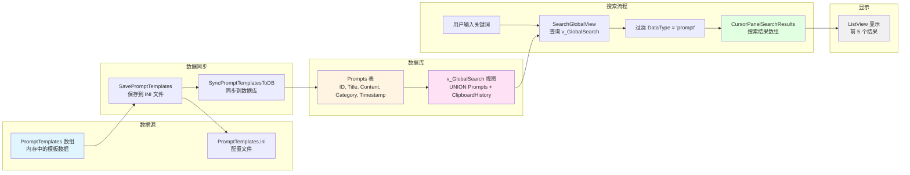
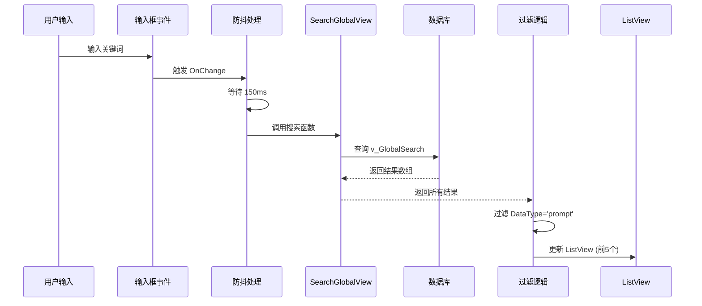
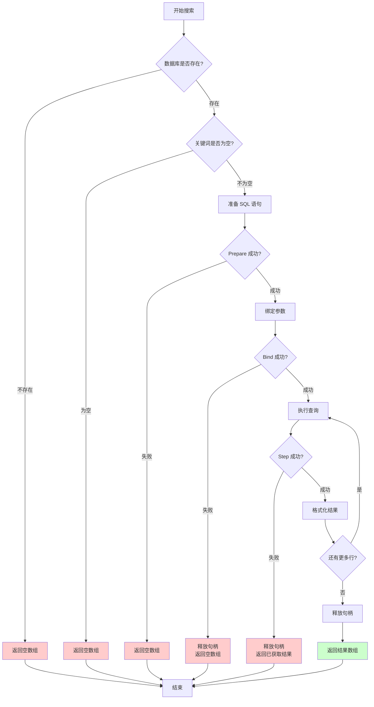
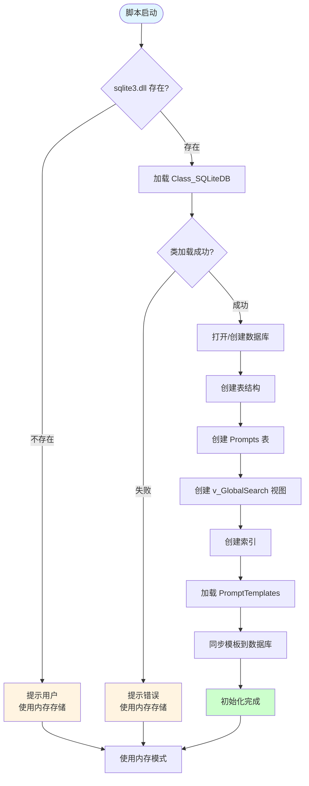
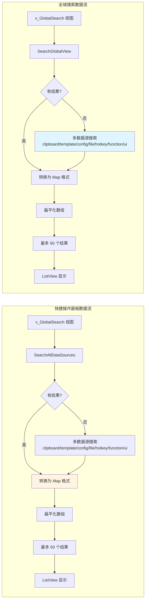

# Cursor 快捷操作面板搜索流程

## 完整流程图

```mermaid
flowchart TD
    Start([用户长按 CapsLock]) --> CheckCapsLock{检测 CapsLock 状态}
    CheckCapsLock -->|按下| SetTimer[设置定时器<br/>等待长按时间<br/>默认 0.5 秒]
    SetTimer --> WaitHold{等待长按时间到达}
    WaitHold -->|时间到达| CheckCapsLock2{CapsLock2 是否仍为 true?}
    CheckCapsLock2 -->|是| ShowPanel[调用 ShowCursorPanel]
    CheckCapsLock2 -->|否| End1[不显示面板<br/>用户可能按了组合键]
    
    ShowPanel --> CreateGUI[创建 GUI 窗口]
    CreateGUI --> CreateInput[创建搜索输入框<br/>CursorPanelSearchEdit]
    CreateInput --> BindEvent[绑定 OnChange 事件<br/>→ ExecuteCursorPanelSearch]
    BindEvent --> CreateListView[创建 ListView<br/>CursorPanelResultLV<br/>始终显示]
    CreateListView --> ShowWindow[显示面板窗口]
    ShowWindow --> WaitInput[等待用户输入]
    
    WaitInput --> UserInput{用户在输入框输入}
    UserInput -->|输入变化| TriggerChange[触发 OnChange 事件]
    TriggerChange --> ExecuteSearch[调用 ExecuteCursorPanelSearch]
    ExecuteSearch --> CheckDebounce{检查防抖定时器}
    CheckDebounce -->|存在| CancelTimer[取消之前的定时器]
    CancelTimer --> SetNewTimer[设置新的防抖定时器<br/>150ms 延迟]
    CheckDebounce -->|不存在| SetNewTimer
    SetNewTimer --> WaitDebounce[等待 150ms]
    WaitDebounce --> DebouncedSearch[调用 DebouncedCursorPanelSearch]
    
    DebouncedSearch --> CheckKeyword{检查关键词长度}
    CheckKeyword -->|长度 < 1| ClearResults[清空 ListView 内容<br/>保持 ListView 显示]
    CheckKeyword -->|长度 >= 1| CallSearchAllDataSources[调用 SearchAllDataSources<br/>Keyword, [], 50]
    
    CallSearchAllDataSources --> CheckDB{检查数据库连接}
    CheckDB -->|未连接| TryMultiSource[尝试多数据源搜索]
    CheckDB -->|已连接| TryGlobalView[尝试 SearchGlobalView<br/>查询 v_GlobalSearch 视图]
    TryGlobalView --> HasResults{有结果?}
    HasResults -->|是| ConvertToMap[转换为 Map 格式<br/>按数据类型分组]
    HasResults -->|否| TryMultiSource
    TryMultiSource --> SearchMultiSource[多数据源搜索<br/>clipboard/template/config/file/hotkey/function/ui]
    SearchMultiSource --> ConvertToMap
    
    ConvertToMap --> FlattenResults[扁平化数组<br/>包含所有类型]
    FlattenResults --> SaveResults[保存到 CursorPanelSearchResults]
    SaveResults --> UpdateListView[更新 ListView 显示]
    
    UpdateListView --> ClearListView[清空 ListView]
    ClearListView --> AddItems[添加所有结果项到 ListView<br/>列: 标题, 来源, 时间<br/>最多 50 个]
    AddItems --> KeepListViewVisible[ListView 始终显示]
    KeepListViewVisible --> HideMoreBtn[隐藏"更多"按钮]
    HideMoreBtn --> End2[完成]
    
    ClearResults --> End2
    ReturnEmpty --> End2
    End1 --> End2
    
    style Start fill:#e1f5ff
    style ShowPanel fill:#fff4e1
    style CallSearchGlobalView fill:#ffe1f5
    style UpdateListView fill:#e1ffe1
    style End2 fill:#f0f0f0
```

## 关键函数说明

### 1. CapsLock 长按检测
- **位置**: `~CapsLock::` 热键处理函数
- **逻辑**: 
  - 设置 `CapsLock = true`, `CapsLock2 = true`
  - 启动定时器 `ShowPanelTimer`，延迟 `CapsLockHoldTimeSeconds` 秒
  - 定时器触发时检查 `CapsLock2` 是否为 true，如果是则显示面板

### 2. 面板创建 (ShowCursorPanel)
- **输入框**: 创建 `CursorPanelSearchEdit`，绑定 `OnChange` 事件
- **ListView**: 创建 `CursorPanelResultLV`，初始状态为显示（`Visible = true`）
- **事件绑定**: `CursorPanelSearchEdit.OnEvent("Change", ExecuteCursorPanelSearch)`

### 3. 搜索防抖 (ExecuteCursorPanelSearch)
- **防抖机制**: 150ms 延迟
- **流程**: 取消旧定时器 → 设置新定时器 → 延迟后执行实际搜索

### 4. 实际搜索 (DebouncedCursorPanelSearch)
- **调用**: `SearchAllDataSources(Keyword, [], 50)`
- **数据源**: 所有数据源（prompt、clipboard、config、file、hotkey、function、ui）
- **显示**: 显示所有结果（最多 50 个），更新 ListView

### 5. 数据库搜索 (SearchGlobalView)
- **SQL 查询**: 
  ```sql
  SELECT Title, Content, Source, Timestamp, OriginalID 
  FROM v_GlobalSearch 
  WHERE LOWER(Title) LIKE ? OR LOWER(Content) LIKE ? 
  ORDER BY Timestamp DESC LIMIT ?
  ```
- **视图来源**: `v_GlobalSearch` 视图包含 `Prompts` 表和 `ClipboardHistory` 表的联合数据

### 6. 数据同步 (SyncPromptTemplatesToDB)
- **触发时机**: `SavePromptTemplates()` 函数末尾调用
- **操作**: 将 `PromptTemplates` 数组中的所有模板同步到数据库 `Prompts` 表
- **SQL**: `INSERT OR REPLACE INTO Prompts (ID, Title, Content, Category, Timestamp) VALUES (?, ?, ?, ?, CURRENT_TIMESTAMP)`

## 可能的问题点

1. **数据库未初始化**: `ClipboardDB = 0` 时，`SearchAllDataSources` 会回退到多数据源搜索
2. **数据未同步**: 如果 `SyncPromptTemplatesToDB()` 未执行，数据库中可能没有 prompt 数据
3. **视图查询失败**: SQL 查询失败时会回退到多数据源搜索
4. **多数据源搜索失败**: 如果所有数据源搜索都失败，返回空结果
5. **ListView 更新失败**: 控件可能已销毁，导致更新失败
6. **结果数量限制**: 最多显示 50 个结果，超出部分不显示

## 数据流图



## 关键数据转换点

### 1. 模板数据 → 数据库


### 2. 搜索查询流程


## 调试建议

1. **检查数据库初始化**
   - 确认 `ClipboardDB` 不为 0
   - 检查 `sqlite3.dll` 是否存在
   - 查看 `InitSQLiteDB()` 是否成功执行

2. **检查数据同步**
   - 确认 `SavePromptTemplates()` 被调用
   - 确认 `SyncPromptTemplatesToDB()` 成功执行
   - 检查数据库中 `Prompts` 表是否有数据

3. **检查视图查询**
   - 验证 `v_GlobalSearch` 视图是否存在
   - 手动执行 SQL 查询测试
   - 检查查询结果是否包含 prompt 数据

4. **检查搜索逻辑**
   - 在 `DebouncedCursorPanelSearch` 中添加日志
   - 打印 `AllDataResults` Map 的键和值
   - 打印 `Results` 数组长度和内容
   - 检查所有数据类型是否都被包含（prompt、clipboard、config、file、hotkey、function、ui）

5. **检查 ListView 更新**
   - 确认 `CursorPanelResultLV` 控件存在
   - 检查 `ListView.Add()` 是否成功
   - 确认 `ListView.Visible = true` 已设置

## 常见问题排查

### 问题1: ListView 没有显示任何数据

**可能原因**:
1. 数据库中所有数据源都为空
2. `SyncPromptTemplatesToDB()` 未执行（影响 prompt 数据）
3. 搜索关键词不匹配任何数据
4. `SearchAllDataSources` 返回空结果（统一视图和多数据源搜索都失败）

**排查步骤**:
```autohotkey
; 在 DebouncedCursorPanelSearch 函数中添加调试代码
AllDataResults := SearchAllDataSources(Keyword, [], 50)
FileAppend("AllDataResults.Count: " . AllDataResults.Count . "`n", "debug.log")

; 检查每个数据类型的结果
for DataType, TypeData in AllDataResults {
    FileAppend("DataType: " . DataType . ", Count: " . TypeData.Count . "`n", "debug.log")
    if (TypeData.HasProp("Items")) {
        for Index, Item in TypeData.Items {
            FileAppend("  Item: " . Item.Title . "`n", "debug.log")
        }
    }
}

Results := []
; ... 扁平化处理 ...
FileAppend("Results.Length: " . Results.Length . "`n", "debug.log")
```

### 问题2: 搜索返回空结果

**可能原因**:
1. `ClipboardDB = 0` (数据库未初始化，会回退到多数据源搜索)
2. SQL 查询失败（会回退到多数据源搜索）
3. 视图 `v_GlobalSearch` 不存在或损坏（会回退到多数据源搜索）
4. 多数据源搜索也失败（所有数据源都没有匹配结果）

**排查步骤**:
```autohotkey
; 在 DebouncedCursorPanelSearch 函数中添加调试代码
; 检查数据库状态
if (!ClipboardDB || ClipboardDB = 0) {
    FileAppend("数据库未初始化，将使用多数据源搜索`n", "debug.log")
} else {
    FileAppend("数据库已初始化`n", "debug.log")
    ; 测试查询
    TestSQL := "SELECT COUNT(*) FROM v_GlobalSearch"
    if (ClipboardDB.Exec(TestSQL)) {
        FileAppend("视图查询成功`n", "debug.log")
    } else {
        FileAppend("视图查询失败: " . ClipboardDB.ErrorMsg . "`n", "debug.log")
    }
}

; 检查 SearchAllDataSources 返回结果
AllDataResults := SearchAllDataSources(Keyword, [], 50)
FileAppend("SearchAllDataSources 返回 " . AllDataResults.Count . " 个数据类型`n", "debug.log")

; 如果统一视图搜索失败，检查多数据源搜索
if (AllDataResults.Count = 0) {
    FileAppend("统一视图搜索无结果，检查多数据源搜索`n", "debug.log")
    ; 可以单独测试各个数据源
    ClipboardResults := SearchClipboardHistory(Keyword, 10)
    FileAppend("剪贴板结果: " . ClipboardResults.Length . "`n", "debug.log")
    
    TemplateResults := SearchPromptTemplates(Keyword, 10)
    FileAppend("模板结果: " . TemplateResults.Length . "`n", "debug.log")
}
```

## 错误处理流程



## 初始化流程



## 代码位置索引

### 关键函数位置

| 函数名 | 行号范围 | 功能说明 |
|--------|---------|---------|
| `~CapsLock::` | ~2725 | CapsLock 热键处理，检测长按 |
| `ShowPanelTimer` | ~2705 | 定时器函数，显示面板 |
| `ShowCursorPanel` | ~3056 | 创建并显示快捷操作面板 |
| `ExecuteCursorPanelSearch` | ~3465 | 输入框 Change 事件处理（防抖） |
| `DebouncedCursorPanelSearch` | ~3484 | 实际搜索执行函数 |
| `SearchGlobalView` | ~10898 | 数据库搜索函数 |
| `SyncPromptTemplatesToDB` | ~1987 | 同步模板到数据库 |
| `SavePromptTemplates` | ~1744 | 保存模板到 INI 文件 |
| `InitSQLiteDB` | ~1831 | 初始化 SQLite 数据库 |

### 关键变量

| 变量名 | 类型 | 说明 |
|--------|------|------|
| `CursorPanelSearchEdit` | Edit 控件 | 搜索输入框 |
| `CursorPanelResultLV` | ListView 控件 | 结果显示列表 |
| `CursorPanelSearchResults` | Array | 搜索结果数组 |
| `ClipboardDB` | SQLiteDB 对象 | 数据库连接 |
| `PromptTemplates` | Array | 内存中的模板数组 |
| `CapsLock2` | Boolean | CapsLock 功能使用标记 |

## 完整调试检查清单

### 阶段1: 基础检查
- [ ] 确认 `sqlite3.dll` 文件存在于脚本目录
- [ ] 确认 `Class_SQLiteDB.ahk` 文件存在且可加载
- [ ] 检查脚本启动时是否有数据库初始化错误提示
- [ ] 确认 `ClipboardDB` 全局变量不为 0

### 阶段2: 数据检查
- [ ] 检查 `PromptTemplates.ini` 文件是否存在且有内容
- [ ] 确认 `PromptTemplates` 数组已加载且不为空
- [ ] 检查数据库中 `Prompts` 表是否有数据
  ```sql
  SELECT COUNT(*) FROM Prompts;
  ```
- [ ] 检查 `v_GlobalSearch` 视图是否正常
  ```sql
  SELECT COUNT(*) FROM v_GlobalSearch WHERE Source = 'prompt';
  ```

### 阶段3: 搜索流程检查
- [ ] 确认输入框 `CursorPanelSearchEdit` 已创建
- [ ] 确认 `OnChange` 事件已绑定
- [ ] 在 `DebouncedCursorPanelSearch` 中添加日志，检查函数是否被调用
- [ ] 检查 `SearchGlobalView` 返回值是否为空
- [ ] 检查过滤后的 `TemplateResults` 数组长度

### 阶段4: 显示检查
- [ ] 确认 `CursorPanelResultLV` 已创建
- [ ] 检查 `ListView.Visible` 是否为 true
- [ ] 检查 `ListView.Add()` 是否成功执行
- [ ] 确认 ListView 列宽设置正确

## 快速修复建议

### 修复1: 强制同步数据到数据库

如果数据库中没有数据，可以手动触发同步：

```autohotkey
; 在脚本中添加测试函数
TestSyncTemplates() {
    global PromptTemplates
    ; 确保模板已加载
    LoadPromptTemplates()
    ; 强制同步到数据库
    SyncPromptTemplatesToDB()
    MsgBox("同步完成，共同步 " . PromptTemplates.Length . " 个模板")
}
```

### 修复2: 检查视图创建

如果视图不存在，可以重新创建：

```autohotkey
RecreateView() {
    global ClipboardDB
    if (!ClipboardDB || ClipboardDB = 0) {
        MsgBox("数据库未初始化")
        return
    }
    
    ; 删除旧视图
    ClipboardDB.Exec("DROP VIEW IF EXISTS v_GlobalSearch")
    
    ; 创建新视图
    SQL := "CREATE VIEW v_GlobalSearch AS " .
           "SELECT Title, Content, 'prompt' AS Source, Timestamp, ID AS OriginalID FROM Prompts " .
           "UNION ALL " .
           "SELECT SUBSTR(Content, 1, 100) AS Title, Content, 'clipboard' AS Source, Timestamp, CAST(ID AS TEXT) AS OriginalID FROM ClipboardHistory"
    
    if (ClipboardDB.Exec(SQL)) {
        MsgBox("视图创建成功")
    } else {
        MsgBox("视图创建失败: " . ClipboardDB.ErrorMsg)
    }
}
```

### 修复3: 添加调试日志

在关键位置添加日志输出：

```autohotkey
; 在 DebouncedCursorPanelSearch 函数开头添加
DebouncedCursorPanelSearch(*) {
    global CursorPanelSearchEdit, CursorPanelResultLV, CursorPanelSearchResults
    global ClipboardDB
    
    ; 调试日志
    DebugLog("=== 开始搜索 ===")
    DebugLog("数据库状态: " . (ClipboardDB && ClipboardDB != 0 ? "已连接" : "未连接"))
    
    Keyword := CursorPanelSearchEdit.Value
    DebugLog("关键词: " . Keyword)
    DebugLog("关键词长度: " . StrLen(Keyword))
    
    ; ... 后续代码
}

; 辅助函数
DebugLog(Message) {
    FileAppend(FormatTime(, "yyyy-MM-dd HH:mm:ss") . " - " . Message . "`n", "cursor_panel_debug.log")
}
```

## 测试用例

### 测试1: 基础搜索测试
1. 长按 CapsLock 打开面板
2. 在输入框输入 "1"
3. 检查 ListView 是否显示结果
4. **预期**: 显示包含 "1" 的 prompt 模板

### 测试2: 空搜索测试
1. 打开面板
2. 输入内容后清空
3. 检查 ListView 是否隐藏
4. **预期**: ListView 隐藏，不显示任何内容

### 测试3: 无匹配结果测试
1. 打开面板
2. 输入不存在的关键词（如 "xyz123abc"）
3. 检查 ListView 状态
4. **预期**: ListView 显示但为空，或隐藏

### 测试4: 数据库连接测试
1. 临时删除 `sqlite3.dll`
2. 重启脚本
3. 尝试搜索
4. **预期**: 搜索返回空结果，但不应崩溃

## 性能优化建议

1. **索引优化**: 确保数据库索引已创建
   - `idx_prompts_title`
   - `idx_prompts_content`
   - `idx_clipboard_content`

2. **查询优化**: 使用 LIMIT 限制结果数量
   - 当前已使用 `LIMIT 100`，可考虑根据实际需求调整

3. **防抖优化**: 当前 150ms 防抖时间，可根据用户体验调整

4. **缓存优化**: 考虑缓存常用搜索结果

## 相关文件

- **主脚本**: `CursorHelper (1).ahk`
- **数据库类**: `lib\Class_SQLiteDB.ahk`
- **配置文件**: `CursorShortcut.ini`
- **模板文件**: `PromptTemplates.ini`
- **数据库文件**: `CursorData.db`

## 已修复的问题

### 修复1: "无框架"问题

**问题描述**: ListView 初始状态为隐藏且坐标未定位，在 AHK v2 中可能从未被正确渲染。

**修复方案**: 在 `ShowCursorPanel()` 函数中，面板显示后：
1. 获取主面板窗口位置
2. 临时显示 ListView（`Visible = true`）
3. 短暂延迟（10ms）确保窗口渲染
4. 立即隐藏 ListView（`Visible = false`）

**代码位置**: `ShowCursorPanel()` 函数，约第 3450-3466 行

```autohotkey
; 【修复坐标偏移问题】无边框窗口必须在 Show 之后显式获取主面板位置
; 确保 ListView 窗口正确初始化并定位到主面板内
try {
    WinGetPos(&PanelX, &PanelY, &PanelW, &PanelH, GuiID_CursorPanel.Hwnd)
    if (PanelX != "" && PanelY != "") {
        ; ListView 的坐标是相对于主面板的，主面板位置已确定，ListView 会自动正确定位
        ; 强制刷新 ListView 窗口，确保其正确渲染（即使隐藏）
        if (CursorPanelResultLV) {
            ; 临时显示并立即隐藏，强制窗口初始化
            CursorPanelResultLV.Visible := true
            Sleep(10)  ; 短暂延迟，确保窗口渲染
            CursorPanelResultLV.Visible := false
        }
    }
} catch as err {
    ; 忽略错误，继续执行
}
```

### 修复2: "坐标偏移"问题

**问题描述**: 快捷面板使用 `-Caption`（无边框），ListView 在 Show 之前可能坐标未定位，导致飘到屏幕外。

**修复方案**: 
- 在面板 `Show()` 之后，显式调用 `WinGetPos()` 获取主面板位置
- 确保 ListView 窗口在正确的父窗口上下文中初始化
- 通过临时显示/隐藏强制窗口正确渲染和定位

**代码位置**: 同修复1，在 `ShowCursorPanel()` 函数中

### 修复3: "搜索死锁"问题

**问题描述**: 输入框为空时，只 Hide ListView，未彻底重置 Results 数组和清空 LV，残留句柄可能导致下一次搜索失效。

**修复方案**: 在 `DebouncedCursorPanelSearch()` 函数中，输入框为空时：
1. 隐藏 ListView 和更多按钮
2. 彻底清空 ListView 内容（`Delete()`）
3. 重置搜索结果数组（`CursorPanelSearchResults := []`）
4. **关键**：释放数据库句柄（`global_ST.Free()`），防止下次搜索时死锁

**代码位置**: `DebouncedCursorPanelSearch()` 函数，约第 3501-3518 行

```autohotkey
Keyword := CursorPanelSearchEdit.Value
if (StrLen(Keyword) < 1) {
    ; 【修复搜索死锁问题】输入框为空时，彻底重置状态
    ; 不仅要 Hide，还要清空所有数据和状态，防止残留句柄导致下一次搜索失效
    try {
        ; 隐藏 ListView 和更多按钮
        CursorPanelResultLV.Visible := false
        CursorPanelShowMoreBtn.Visible := false
        
        ; 彻底清空 ListView 内容
        CursorPanelResultLV.Opt("-Redraw")
        CursorPanelResultLV.Delete()
        CursorPanelResultLV.Opt("+Redraw")
        
        ; 重置搜索结果数组
        CursorPanelSearchResults := []
        
        ; 【关键】确保数据库句柄已释放，防止下次搜索时死锁
        if (IsObject(global_ST) && global_ST.HasProp("Free")) {
            try {
                global_ST.Free()
            } catch as err {
                ; 忽略错误
            }
            global_ST := 0
        }
    } catch as err {
        ; 控件可能已销毁，忽略错误
    }
    
    ; 调整面板高度和按钮位置（ListView隐藏时）
    UpdateCursorPanelLayout(false)
    return
}
```

## 修复效果

1. **ListView 正确初始化**: 即使初始隐藏，窗口也会被正确渲染和定位
2. **坐标定位准确**: 无边框窗口下，ListView 始终在正确位置显示
3. **搜索功能稳定**: 清空搜索后不会残留句柄，下次搜索正常工作
4. **性能优化**: 通过显式释放句柄，避免内存泄漏和资源占用

## 测试验证

修复后，请测试以下场景：

1. **基础搜索测试**
   - 打开面板 → 输入关键词 → 查看 ListView 是否正确显示
   - 清空输入框 → 查看 ListView 是否正确隐藏
   - 再次输入关键词 → 查看搜索是否正常工作

2. **多次搜索测试**
   - 连续多次输入/清空 → 确认不会出现死锁
   - 快速输入多个关键词 → 确认防抖机制正常

3. **窗口位置测试**
   - 拖动面板到不同位置 → 确认 ListView 始终在正确位置
   - 多显示器环境下测试 → 确认坐标计算正确

## 快捷操作面板搜索 vs 全域搜索（CapsLock+F）对比

### 流程对比图


### 详细对比表

| 对比项 | 快捷操作面板搜索 | 全域搜索（CapsLock+F） |
|--------|----------------|----------------------|
| **触发方式** | 长按 CapsLock 显示面板后输入 | CapsLock + F 打开搜索中心 |
| **输入框事件** | `ExecuteCursorPanelSearch` | `ExecuteSearchCenterSearch` |
| **防抖延迟** | 150ms | 150ms |
| **搜索函数** | `SearchGlobalView(Keyword, 100)` | `SearchAllDataSources(Keyword, [], 50)` |
| **数据源** | 所有数据源（统一视图 + 多数据源回退） | 所有数据源（统一视图 + 多数据源回退） |
| **结果过滤** | 包含所有数据类型 | 包含所有数据类型 |
| **结果数量** | 最多 50 个（无"更多"按钮） | 最多 50 个（无"更多"按钮） |
| **ListView 显示** | 始终显示 | 始终显示 |
| **窗口特性** | 无边框（-Caption），小窗口（420px宽） | 无边框（-Caption），大窗口（900x600） |
| **功能定位** | 全局搜索所有内容 | 全局搜索所有内容 |

### 搜索函数对比

#### 快捷操作面板：SearchAllDataSources

```autohotkey
SearchAllDataSources(Keyword, DataTypes := [], MaxResults := 10) {
    ; 优先使用统一视图搜索
    GlobalResults := SearchGlobalView(Keyword, 100)
    
    ; 如果没有结果，回退到多数据源搜索
    ; 搜索：clipboard, template, config, file, hotkey, function, ui
    
    ; 返回 Map 格式，按数据类型分组
}
```

**特点**：
- 优先使用统一视图
- 支持回退到多数据源搜索
- 返回按数据类型分组的结果
- 支持指定数据类型过滤

#### 全域搜索：SearchAllDataSources

```autohotkey
SearchAllDataSources(Keyword, DataTypes := [], MaxResults := 10) {
    ; 优先使用统一视图搜索
    GlobalResults := SearchGlobalView(Keyword, 100)
    
    ; 如果没有结果，回退到多数据源搜索
    ; 搜索：clipboard, template, config, file, hotkey, function, ui
    
    ; 返回 Map 格式，按数据类型分组
}
```

**特点**：
- 优先使用统一视图
- 支持回退到多数据源搜索
- 返回按数据类型分组的结果
- 支持指定数据类型过滤

### 数据流对比



### 关键差异点

#### 1. 数据源范围

**快捷操作面板**：
- ✅ 仅搜索 `v_GlobalSearch` 视图
- ✅ 只显示 `prompt` 类型结果
- ❌ 不搜索其他数据源（config、file、hotkey 等）

**全域搜索**：
- ✅ 搜索所有数据源
- ✅ 显示所有类型结果
- ✅ 支持回退机制（统一视图失败时使用多数据源）

#### 2. 结果处理

**快捷操作面板**：
```autohotkey
; 包含所有类型
for DataType, TypeData in AllDataResults {
    for Index, Item in TypeData.Items {
        Results.Push(Item)  ; 所有结果都添加
    }
}

; 显示所有结果（最多 50 个）
for Index, Item in Results {
    CursorPanelResultLV.Add(, Item.Title, Item.Source, Item.Time)
}
```

**全域搜索**：
```autohotkey
; 包含所有类型
for DataType, TypeData in AllDataResults {
    for Index, Item in TypeData.Items {
        Results.Push(Item)  ; 所有结果都添加
    }
}

; 显示所有结果（最多 50 个）
for Index, Item in Results {
    SearchCenterResultLV.Add(, Item.Title, Item.Source, Item.Time)
}
```

#### 3. UI 显示策略

**快捷操作面板**：
- ListView 始终显示（`Visible = true`）
- 无结果时显示空列表
- 无"更多"按钮（直接显示所有结果）
- 小窗口，紧凑布局

**全域搜索**：
- ListView 始终显示
- 无结果时显示空列表
- 无"更多"按钮（直接显示所有结果）
- 大窗口，完整布局

#### 4. 句柄管理

**快捷操作面板**：
```autohotkey
; 使用 GlobalSearchEngine.ReleaseOldStatement()（与全域搜索保持一致）
GlobalSearchEngine.ReleaseOldStatement()

; 清空时释放句柄
if (StrLen(Keyword) < 1) {
    ; ... 清空 ListView ...
    if (IsObject(global_ST) && global_ST.HasProp("Free")) {
        global_ST.Free()
        global_ST := 0
    }
}
```

**全域搜索**：
```autohotkey
; 使用 GlobalSearchEngine.ReleaseOldStatement()
GlobalSearchEngine.ReleaseOldStatement()

; 清空时不释放句柄（因为可能立即再次搜索）
if (StrLen(Keyword) < 1) {
    SearchCenterResultLV.Delete()
    SearchCenterSearchResults := []
    return
}
```

### 使用场景建议

#### 快捷操作面板搜索
- ✅ 全局搜索所有内容
- ✅ 在快捷操作面板中快速定位
- ✅ 搜索所有类型的结果（prompt、clipboard、config、file、hotkey、function、ui）
- ✅ 小窗口，不占用太多屏幕空间

#### 全域搜索（CapsLock+F）
- ✅ 全局搜索所有内容
- ✅ 需要搜索配置、文件、快捷键等
- ✅ 需要查看所有类型的结果
- ✅ 大窗口，显示更多信息

### 代码位置索引

| 功能 | 快捷操作面板 | 全域搜索 |
|------|------------|---------|
| **显示函数** | `ShowCursorPanel()` ~3056 | `ShowSearchCenter()` ~20238 |
| **输入框事件** | `ExecuteCursorPanelSearch()` ~3465 | `ExecuteSearchCenterSearch()` ~20857 |
| **防抖搜索** | `DebouncedCursorPanelSearch()` ~3484 | `DebouncedSearchCenter()` ~20872 |
| **搜索函数** | `SearchAllDataSources()` ~11058 | `SearchAllDataSources()` ~11058 |
| **结果处理** | 包含所有类型，最多 50 个 | 包含所有类型，最多 50 个 |
| **ListView** | `CursorPanelResultLV` | `SearchCenterResultLV` |

### 优化建议

1. **统一搜索逻辑**：✅ 已完成 - 快捷操作面板和全域搜索都使用 `SearchAllDataSources`，搜索所有数据源
2. **结果数量配置**：允许用户配置快捷操作面板和全域搜索显示的结果数量（当前固定为 50 个）
3. **共享搜索函数**：✅ 已完成 - 两个搜索共享 `SearchAllDataSources` 函数，逻辑完全一致
4. **性能优化**：两个搜索的结果数量都较多（最多 50 个），可以考虑虚拟滚动或分页
5. **双击事件处理**：✅ 已完成 - 快捷操作面板已支持所有数据类型的双击操作（prompt、clipboard、file 等）
6. **UI 一致性**：✅ 已完成 - 两个搜索的 ListView 都始终显示，保持一致的交互体验

## 修改总结

### 快捷操作面板搜索功能升级

**修改前**：
- 仅搜索 `v_GlobalSearch` 视图
- 只显示 `prompt` 类型结果
- 显示前 5 个结果，有"更多"按钮
- ListView 初始隐藏，有结果才显示

**修改后**：
- ✅ 使用 `SearchAllDataSources` 搜索所有数据源
- ✅ 显示所有类型结果（prompt、clipboard、config、file、hotkey、function、ui）
- ✅ 显示所有结果（最多 50 个），无"更多"按钮
- ✅ ListView 始终显示，保持一致的交互体验
- ✅ 支持所有数据类型的双击操作
- ✅ 使用 `GlobalSearchEngine.ReleaseOldStatement()` 管理句柄

### 主要变化

1. **搜索范围扩展**：从仅搜索 prompt 扩展到搜索所有数据源
2. **结果数量增加**：从 5 个增加到 50 个
3. **UI 显示优化**：ListView 始终显示，无需等待结果
4. **功能统一**：与全域搜索（CapsLock+F）功能完全一致
5. **交互改进**：支持所有数据类型的操作，不再局限于 prompt

### 代码变更位置

- `ShowCursorPanel()` ~3196: ListView 初始状态改为 `Visible = true`
- `DebouncedCursorPanelSearch()` ~3504: 
  - 使用 `SearchAllDataSources()` 替代 `SearchGlobalView()`
  - 移除 prompt 类型过滤
  - 显示所有结果（最多 50 个）
  - 使用 `GlobalSearchEngine.ReleaseOldStatement()` 管理句柄
- `OnCursorPanelResultDoubleClick()` ~3698: 支持所有数据类型的双击操作

### 兼容性说明

- ✅ 向后兼容：旧的 prompt 数据仍然可以搜索和显示
- ✅ 功能增强：新增对其他数据类型的支持
- ✅ 性能优化：使用统一的搜索函数，减少代码重复
- ✅ 用户体验：更一致的交互体验，更强大的搜索功能
